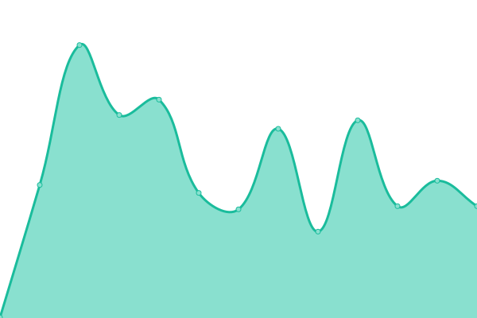

# [📈 Live Status](https://upptime.github.io/upptime): <!--live status--> **🟧 Partial outage**

This repository contains the open-source uptime monitor and status page for [Upptime](https://upptime.js.org), powered by [Upptime](https://github.com/upptime/upptime).

With [Upptime](https://upptime.js.org), you can get your own unlimited and free uptime monitor and status page, powered entirely by a GitHub repository. We use [Issues](https://github.com/upptime/upptime/issues) as incident reports, [Actions](https://github.com/upptime/upptime/actions) as uptime monitors, and [Pages](https://upptime.github.io/upptime) for the status page.

<!--start: status pages-->
<!-- This summary is generated by Upptime (https://github.com/upptime/upptime) -->
<!-- Do not edit this manually, your changes will be overwritten -->
<!-- prettier-ignore -->
| URL | Status | History | Response Time | Uptime |
| --- | ------ | ------- | ------------- | ------ |
|  [GitLab](https://git.ongarde.net/) | 🟩 Up | [git-lab.yml](https://github.com/Async0x42/epic-upptime/commits/HEAD/history/git-lab.yml) | 

 449ms
     
 | 

<a href="https://async0x42.github.io/epic-upptime/history/git-lab">100.00%</a>
    

|  [Snap Survey (External)](https://survey-sondage.forces.gc.ca/snapwebhost/) | 🟥 Down | [snap-survey-external.yml](https://github.com/Async0x42/epic-upptime/commits/HEAD/history/snap-survey-external.yml) | 

 306ms
     
 | 

<a href="https://async0x42.github.io/epic-upptime/history/snap-survey-external">100.00%</a>
    

|  [Learning Portal](https://lp-pa.forces.gc.ca/portal/) | 🟩 Up | [learning-portal.yml](https://github.com/Async0x42/epic-upptime/commits/HEAD/history/learning-portal.yml) | 

 501ms
     
 | 

<a href="https://async0x42.github.io/epic-upptime/history/learning-portal">100.00%</a>
    

|  [H5P](https://h5p.ongarde.net/) | 🟩 Up | [h5-p.yml](https://github.com/Async0x42/epic-upptime/commits/HEAD/history/h5-p.yml) | 

 593ms
     
 | 

<a href="https://async0x42.github.io/epic-upptime/history/h5-p">100.00%</a>
    

|  [CAF-ACE](https://caface-rfacace.forces.gc.ca) | 🟩 Up | [caf-ace.yml](https://github.com/Async0x42/epic-upptime/commits/HEAD/history/caf-ace.yml) | 

 299ms
     
 | 

<a href="https://async0x42.github.io/epic-upptime/history/caf-ace">100.00%</a>
    

|  [DGCB (Staging)](https://dgcb.ongarde.net) | 🟩 Up | [dgcb-staging.yml](https://github.com/Async0x42/epic-upptime/commits/HEAD/history/dgcb-staging.yml) | 

 270ms
     
 | 

<a href="https://async0x42.github.io/epic-upptime/history/dgcb-staging">100.00%</a>
    

|  [DGCB Knowledge](https://dgcb-knowledge.ongarde.net) | 🟩 Up | [dgcb-knowledge.yml](https://github.com/Async0x42/epic-upptime/commits/HEAD/history/dgcb-knowledge.yml) | 

 413ms
     
 | 

<a href="https://async0x42.github.io/epic-upptime/history/dgcb-knowledge">100.00%</a>
    

|  [DTC (Staging)](https://dtc.ongarde.net) | 🟩 Up | [dtc-staging.yml](https://github.com/Async0x42/epic-upptime/commits/HEAD/history/dtc-staging.yml) | 

 369ms
     
 | 

<a href="https://async0x42.github.io/epic-upptime/history/dtc-staging">100.00%</a>
    

|  [Equella](https://equella.ongarde.net) | 🟩 Up | [equella.yml](https://github.com/Async0x42/epic-upptime/commits/HEAD/history/equella.yml) | 

 337ms
     
 | 

<a href="https://async0x42.github.io/epic-upptime/history/equella">100.00%</a>
    

|  [Forces.ca](https://forces.ca) | 🟩 Up | [forces-ca.yml](https://github.com/Async0x42/epic-upptime/commits/HEAD/history/forces-ca.yml) | 

 525ms
     
 | 

<a href="https://async0x42.github.io/epic-upptime/history/forces-ca">100.00%</a>
    

|  [Forces.ca (Staging)](https://forces.ongarde.net) | 🟩 Up | [forces-ca-staging.yml](https://github.com/Async0x42/epic-upptime/commits/HEAD/history/forces-ca-staging.yml) | 

 570ms
     
 | 

<a href="https://async0x42.github.io/epic-upptime/history/forces-ca-staging">100.00%</a>
    

|  [Snipe-IT](https://snipe.ongarde.net) | 🟩 Up | [snipe-it.yml](https://github.com/Async0x42/epic-upptime/commits/HEAD/history/snipe-it.yml) | 

 465ms
     
 | 

<a href="https://async0x42.github.io/epic-upptime/history/snipe-it">100.00%</a>
    

|  [FMOST-Outcan](https://outcan.ongarde.net) | 🟩 Up | [fmost-outcan.yml](https://github.com/Async0x42/epic-upptime/commits/HEAD/history/fmost-outcan.yml) | 

 304ms
     
 | 

<a href="https://async0x42.github.io/epic-upptime/history/fmost-outcan">100.00%</a>
    

|  [Learning Locker](https://lrs.ongarde.net) | 🟩 Up | [learning-locker.yml](https://github.com/Async0x42/epic-upptime/commits/HEAD/history/learning-locker.yml) | 

 276ms
     
 | 

<a href="https://async0x42.github.io/epic-upptime/history/learning-locker">100.00%</a>
    

|  [Keycloak](https://keycloak.ongarde.net) | 🟩 Up | [keycloak.yml](https://github.com/Async0x42/epic-upptime/commits/HEAD/history/keycloak.yml) | 

 690ms
     
 | 

<a href="https://async0x42.github.io/epic-upptime/history/keycloak">100.00%</a>
    

<!--end: status pages-->

[**Visit our status website →**](https://upptime.github.io/upptime)

## 📄 License

- Powered by: [Upptime](https://github.com/upptime/upptime)
- Code: [MIT](./LICENSE) © [Upptime](https://upptime.js.org)
- Data in the `./history` directory: [Open Database License](https://opendatacommons.org/licenses/odbl/1-0/)
